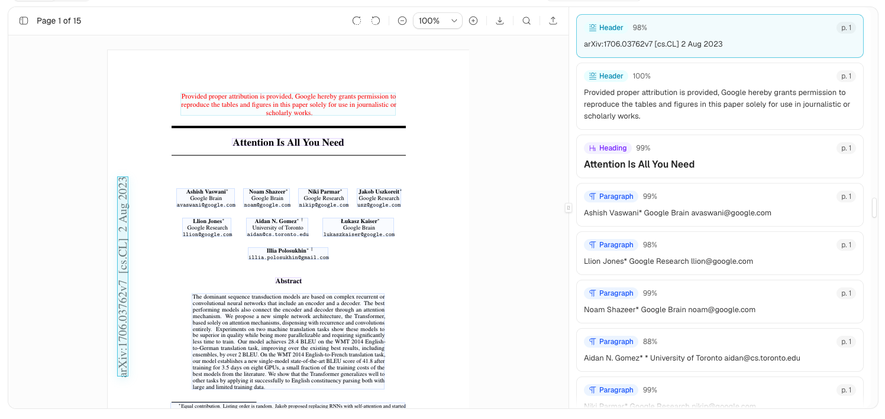
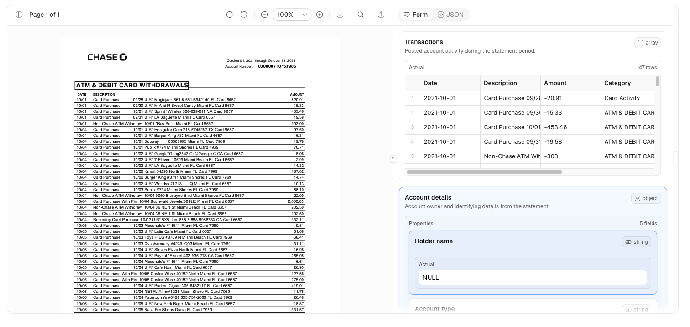
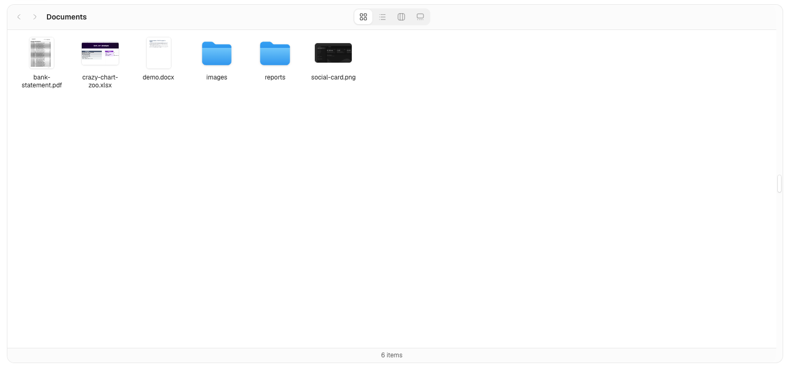

# Extend UI

[Extend UI](https://www.extend.ai/ui) is a set of open-source components for
document agents, user-facing document flows, and internal tools.


The library includes 14 components and examples for PDF, DOCX, and XLSX
viewers, plus bounding box citations, file upload, file thumbnails,
e-signature, document splitting, layout blocks, and Finder-style file browsing.
Components are fully customizable, MIT licensed, and available through the
shadcn component registry.

Extend UI started as the internal component layer for
[Extend](https://www.extend.ai). We built it after evaluating existing file
viewer and document component libraries and needing more complete, polished
building blocks for document-heavy products. The components are maintained in
production at Extend and are used across workflows that process millions of
pages, so fixes and improvements continue to flow back into the project.

Use Extend UI when you need document viewers, review surfaces, file-management
interfaces, or agent-facing document tools without starting from a generic
viewer library. Because each component is installed as source, it also works
well with design-system agents and prototyping tools that need editable React
and Tailwind code.

## Links

- Documentation: [https://www.extend.ai/ui](https://www.extend.ai/ui)
- GitHub: [extend-hq/ui](https://github.com/extend-hq/ui)
- Registry namespace: `@extend/*`

## Getting Started

Configure the style-aware registry in your `components.json`:

```json
{
  "registries": {
    "@extend": "https://www.extend.ai/ui/r/styles/{style}/{name}.json"
  }
}
```

Then install a component with the shadcn CLI:

```bash
npx shadcn@latest add @extend/pdf-viewer
```

Then render the installed component from your app:

```tsx
import { PDFViewer } from "@/components/extend/pdf-viewer"

export default function Page() {
  return <PDFViewer src="/sample.pdf" className="h-[720px]" />
}
```

The `react-pdf` version of the PDF viewer is available at
[pdf-viewer.tsx](https://github.com/extend-hq/ui/blob/2dd84954269e817a2c17a44c672ae801df1bfc3d/apps/v4/components/ui/pdf-viewer.tsx).

Extend UI components are copied into your project as source, so you can adapt
them to your app. Shared primitives such as `Button`, `Select`, `Dialog`,
and `Tooltip` are imported directly from your existing UI components. The
registry selects Base or Radix source using your configured style and transforms
icons for your selected icon library. Keep existing primitives when the CLI
asks about overwriting them. If your project uses a different alias or design-system path, update the
generated imports to match, for example changing
`@/components/ui/button` or `@/components/ui/select` to your local primitive
paths. You can also set those aliases in `components.json` before installing so
new components are generated closer to your app structure.

Use current shadcn primitive APIs. The historical `default` style is
[deprecated upstream](https://ui.shadcn.com/docs/components-json#style) and must
be migrated before installing.

## Examples

### Layout Blocks

Inspect OCR and layout output with selectable blocks, confidence, markdown text,
and PDF overlays that stay connected to the rendered page.



```bash
npx shadcn@latest add @extend/layout-blocks-block
```

```tsx
import type { ParsedOcrOutput } from "@/components/extend/layout-blocks"
import { OcrBlocksBlock } from "@/components/blocks/layout-blocks-block"

const output: ParsedOcrOutput = {
  chunks: [
    {
      blocks: [
        {
          id: "title",
          type: "heading",
          content: "Statement of Work",
          metadata: {
            page: { number: 1, width: 612, height: 792 },
            avgOcrConfidence: 0.99,
          },
          boundingBox: { left: 72, top: 96, right: 360, bottom: 124 },
        },
      ],
    },
  ],
}

export default function Page() {
  return <OcrBlocksBlock file="/documents/statement.pdf" output={output} />
}
```

### Bounding Box Citations

Review extracted values against the source PDF with field-level citations,
editable form controls, JSON diffing, and page overlays.



```bash
npx shadcn@latest add @extend/bounding-box-citations-block
```

```tsx
import type { ReviewField } from "@/components/extend/bounding-box-citations"
import { HumanReviewBlock } from "@/components/blocks/bounding-box-citations-block"

const fields: ReviewField[] = [
  {
    key: "invoice_total",
    schema: {
      type: "number",
      title: "Invoice total",
      description: "Total amount due on the invoice.",
    },
    actual: 1280.5,
    expected: 1280.5,
    location: {
      page: 1,
      area: { left: 62, top: 82, width: 22, height: 4 },
    },
  },
]

export default function Page() {
  return (
    <HumanReviewBlock
      file="/documents/invoice.pdf"
      fields={fields}
      className="h-[720px]"
    />
  )
}
```

### File System

A Finder-style file browser for object-store manifests. It supports icon, list,
column, and gallery views, and opens PDF, DOCX, XLSX, and image files in viewer
dialogs.



```bash
npx shadcn@latest add @extend/file-system-block
```

```tsx
import type { FileSystemItem } from "@/components/extend/file-system"
import { FileSystemBlock } from "@/components/blocks/file-system-block"

const items: FileSystemItem[] = [
  {
    kind: "folder",
    path: "reports/",
    hasChildren: true,
  },
  {
    kind: "file",
    path: "bank-statement.pdf",
    contentType: "application/pdf",
    url: "/documents/bank-statement.pdf",
    previewImageUrl: "/documents/bank-statement-preview.png",
  },
]

export default function Page() {
  return (
    <FileSystemBlock
      items={items}
      title="Documents"
      defaultView="icons"
      className="h-[720px]"
      getFileUrl={(file) =>
        `/api/files/sign?path=${encodeURIComponent(file.path)}`
      }
      loadChildren={async ({ path }) => {
        const response = await fetch(
          `/api/files?prefix=${encodeURIComponent(path)}`
        )
        return response.json()
      }}
    />
  )
}
```

## Popular Components

```bash
npx shadcn@latest add @extend/pdf-viewer
npx shadcn@latest add @extend/docx-viewer
npx shadcn@latest add @extend/xlsx-viewer
npx shadcn@latest add @extend/file-upload
npx shadcn@latest add @extend/file-thumbnail
npx shadcn@latest add @extend/e-signature
```

## Development

```bash
pnpm install
pnpm v4:dev
```

The site runs at `http://localhost:4000`.

## Created By

Extend UI is built and maintained by [Extend](https://www.extend.ai) for teams
building modern document processing products.

## License

Licensed under the [MIT license](./LICENSE.md).
